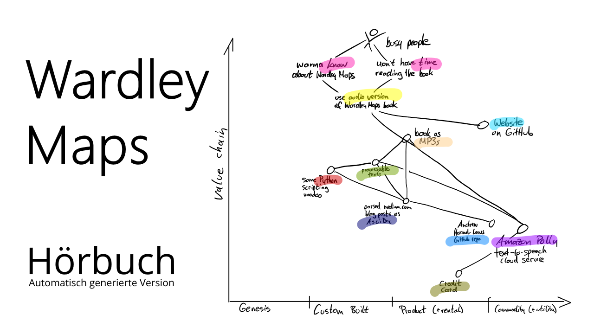

Dies ist die (synthetisch erzeugte) Audioversion von [Simon Wardleys](https://twitter.com/swardley) Buch ["Wardley Maps &ndash; Topographical intelligence in business"](https://medium.com/wardleymaps).

# Mitmachen!

Das deutschsprachige Hörbuch baut auf einer maschinell übersetzen Version auf. Wenn Dir Verbesserungen bei der Übersetzung einfallen, kannst Du diese gerne in dem [Übersetzungsprojekt](https://github.com/selfscrum/wardley-maps-book) einbringen. Wenn Dir Dinge bzgl. der Aussprache auffallen, hinterlasse gerne einen [Hinweis für das Hörbuch](https://github.com/feststelltaste/wardley-maps-hoerbuch/issues). Die Übersetzung und Hörbuch werden  dann von Zeit zu Zeit aktualisiert.

# MP3 Einzelversionen

Hier kannst Du die MP3s direkt auf der Website anhören. Sie sind in kleine Hörhäppchen für zwischendurch aufgeteilt. Viel Spaß!






<a href="{{ 'https://wardley-maps-hoerbuch.s3.eu-central-1.amazonaws.com/de-DE-Wavenet-B/mp3/' | append: filename | escape }}">{{title}}</a>




# Mehr Informationen

- <http://list.wardleymaps.com> - Nützliche Ressourcen zum Thema Wardley Maps.
- <https://learnwardleymapping.com/> - Eine hervorragende Einführung in Wardley Maps.


